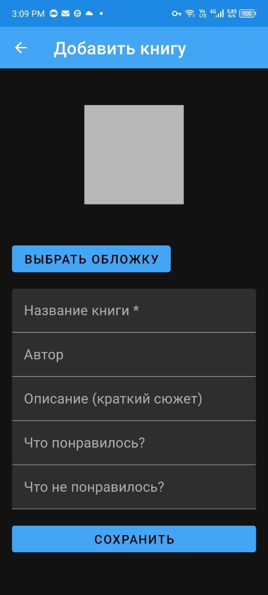
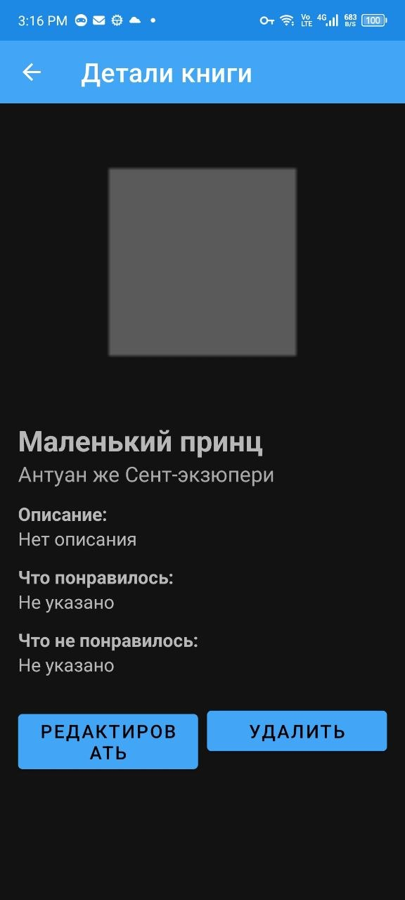
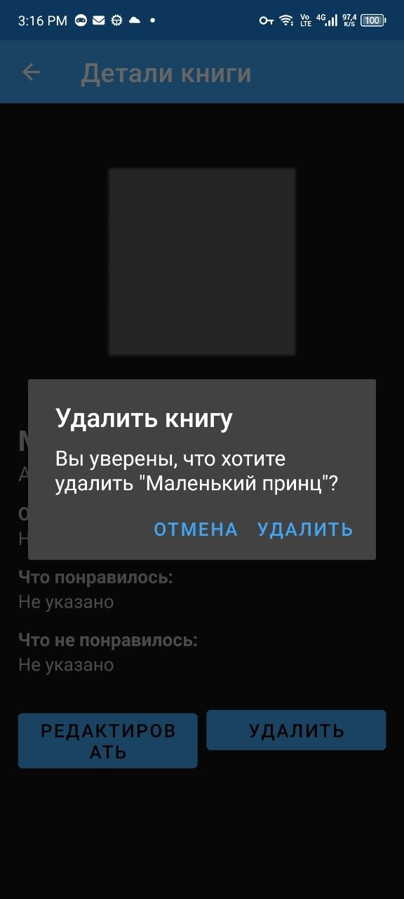

# Personal Library – приложение для учёта прочитанных книг

**Выполнила:** [Ваше ФИО]  
**Группа:** [Номер группы]  
**Тема:** Личная библиотека (каталог книг)

## Описание
Приложение позволяет вести личную коллекцию книг: добавлять новые записи с названием, автором, кратким описанием, отзывом (что понравилось / не понравилось) и обложкой из галереи. Все данные сохраняются локально в SQLite и не теряются после перезапуска приложения.

## Функциональность
- **Главный экран** – список книг с обложками в виде сетки (RecyclerView)
- **Добавление книги** – поля для ввода информации и выбор изображения из галереи
- **Просмотр деталей** – полная информация о книге, включая отзыв
- **Редактирование** – изменение любых полей и замена обложки
- **Удаление** – с подтверждением действия
- **Валидация** – поле «Название» обязательно для заполнения

## Технологии
- **Язык:** Java
- **UI:** XML, Material Design, RecyclerView, CardView
- **Загрузка изображений:** Glide
- **Хранение данных:** SQLite (локальная база данных)
- **Среда разработки:** Android Studio (Groovy DSL)

## Скриншоты

| Главный экран | Экран добавления | Экран деталей |
|---------------|------------------|---------------|
|  |  |  |

| Диалог удаления |
|-----------------|
|  |

## Запуск проекта
1. Клонируйте репозиторий:  
2. Откройте проект в **Android Studio**.
3. Синхронизируйте Gradle (если попросит – нажмите Sync Now).
4. Запустите приложение на эмуляторе с **API 24+** или на реальном устройстве.

## Структура проекта
```
app/src/main/java/com/example/personallibrary/
├── activities/ # все экраны
├── adapter/ # адаптер для списка
├── data/ # модель и работа с БД
└── utils/ # утилиты (сохранение изображений)
res/layout/ # XML-разметки
```

## Что реализовано
- 4 экрана (главный, добавление, детали, редактирование)
- CRUD (Create, Read, Update, Delete)
- Хранение в SQLite (данные сохраняются после закрытия приложения)
- Загрузка обложек из галереи
- Проверка ввода (название не может быть пустым)
- Кнопка «Назад» на всех вспомогательных экранах

## Планы по улучшению
- Поиск и фильтрация
- Сортировка (по дате, по алфавиту)
- Оценка книг (звёзды)
- Экспорт/импорт библиотеки в JSON
- Облачное резервное копирование (Firebase)

## Лицензия
Учебный проект.
